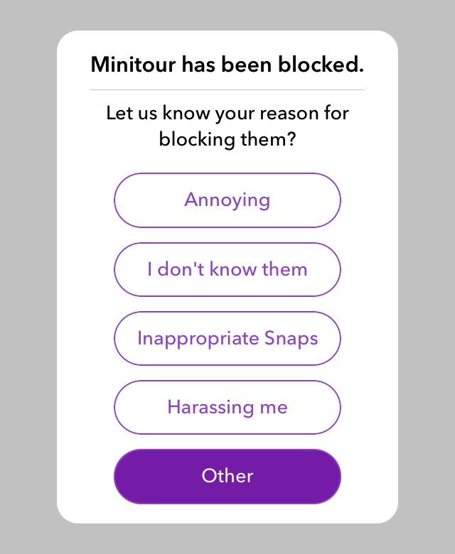

# AZDialogViewController
A highly customizable alert dialog controller that mimics Snapchat's alert dialog.


## Screenshots

   
 
  
  
 
 
## Installation


### Cocoa Pods:

```bash
pod 'AZDialogView'
```

### Manual:

Simply drag and drop the ```Sources``` folder to your project.
 
## Usage

Create an instance of AZDialogViewController:
```swift
let dialogController = AZDialogViewController(title: "Antonio Zaitoun", message: "minitour")
```

#### Customize:
```swift
dialogController.dismissDirection = .bottom
dialogController.dismissWithOutsideTouch = true
dialogController.showSeparator = false
```

#### Add Actions:
```swift
dialogController.addAction(AZDialogAction(title: "Edit Name", handler: { (dialog) -> (Void) in
        //add your actions here.
        dialog.dismiss()
}))
        
dialogController.addAction(AZDialogAction(title: "Remove Friend", handler: { (dialog) -> (Void) in
        //add your actions here.
        dialog.dismiss()
}))
        
dialogController.addAction(AZDialogAction(title: "Block", handler: { (dialog) -> (Void) in
        //add your actions here.
        dialog.dismiss()
}))
```

#### Add Image:
```swift
dialogController.imageHandler = { (imageView) in
       imageView.image = UIImage(named: "your_image_here")
       imageView.contentMode = .scaleAspectFill
       return true //must return true, otherwise image won't show.
}
```

#### Customize Action Buttons Style:
```swift
dialogController.buttonStyle = { (button,height,position) in
     button.setBackgroundImage(UIImage.imageWithColor(self.primaryColorDark), for: .highlighted)
     button.setTitleColor(UIColor.white, for: .highlighted)
     button.setTitleColor(self.primaryColor, for: .normal)
     button.layer.masksToBounds = true
     button.layer.borderColor = self.primaryColor.cgColor
}
```

#### Customize Tool Buttons:
```swift
dialogController.rightToolStyle = { (button) in
        button.setImage(UIImage(named: "ic_share"), for: [])
        button.tintColor = .lightGray
        return true
}      
dialogController.rightToolAction = { (button) in
        print("Share function")
}

dialogController.leftToolStyle = { (button) in
        button.setImage(UIImage(named: "ic_share"), for: [])
        button.tintColor = .lightGray
        return true
}      
dialogController.leftToolAction = { (button) in
        print("Share function")
}

```

#### Customize Cancel Button Style:
```swift
dialogController.cancelButtonStyle = { (button,height) in
        button.tintColor = self.primaryColor
        button.setTitle("CANCEL", for: [])
        return true //must return true, otherwise cancel button won't show.
}
```

#### Present The dialog:
```swift
dialogController.show(in: self)
```
