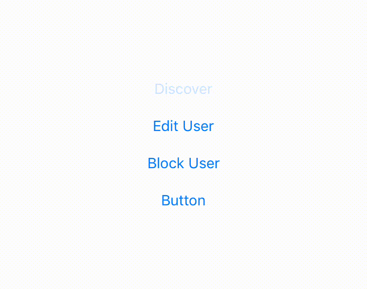
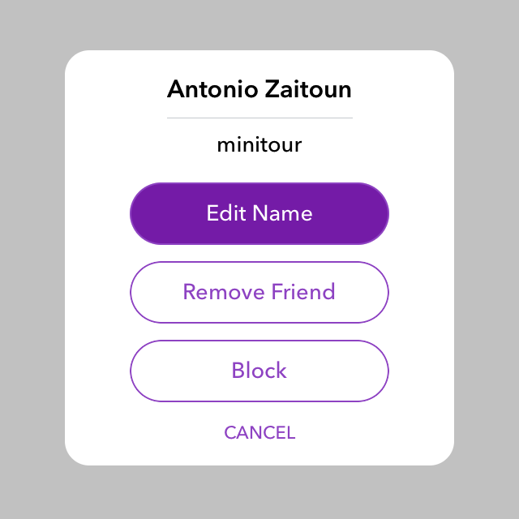
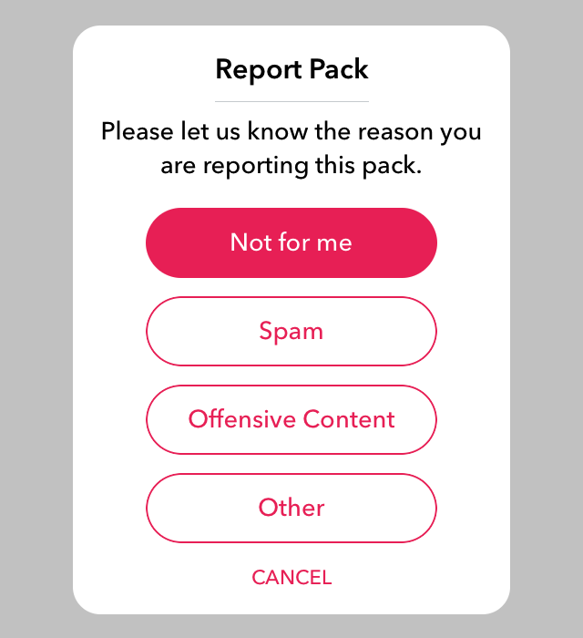

# AZDialogViewController
A highly customizable alert dialog controller that mimics Snapchat's alert dialog.

[]()
[]()
[]()
## Screenshots

    
  
  
 
 
## Installation


### CocoaPods:

```ruby
pod 'AZDialogView'
```

### Carthage:

```ruby
github "Minitour/AZDialogViewController"
```

### Manual:

Simply drag and drop the ```Sources``` folder to your project.
 
## Usage

Create an instance of AZDialogViewController:
```swift
let dialog = AZDialogViewController(title: "Antonio Zaitoun", message: "minitour")
```

#### Customize:
```swift
dialog.dismissDirection = .bottom

dialog.dismissWithOutsideTouch = true

dialog.showSeparator = false

dialog.separatorColor = UIColor.blue

dialog.allowDragGesture = false
```

#### Add Actions:
```swift
dialog.addAction(AZDialogAction(title: "Edit Name") { (dialog) -> (Void) in
        //add your actions here.
        dialog.dismiss()
})
        
dialog.addAction(AZDialogAction(title: "Remove Friend") { (dialog) -> (Void) in
        //add your actions here.
        dialog.dismiss()
})
        
dialog.addAction(AZDialogAction(title: "Block") { (dialog) -> (Void) in
        //add your actions here.
        dialog.dismiss()
})
```

#### Add Image:
```swift
dialog.imageHandler = { (imageView) in
       imageView.image = UIImage(named: "your_image_here")
       imageView.contentMode = .scaleAspectFill
       return true //must return true, otherwise image won't show.
}
```

### Custom View
```swift
/*
 customViewSizeRatio is the precentage of the height in respect to the width of the view. 
 i.e. if the width is 100 and we set customViewSizeRatio to be 0.2 then the height will be 20. 
 The default value is 0.0.
*/
dialog.customViewSizeRatio = 0.2

//Add the subviews
let container = dialog.container
let indicator = UIActivityIndicatorView(activityIndicatorStyle: .gray)
dialog.container.addSubview(indicator)

//add constraints
indicator.translatesAutoresizingMaskIntoConstraints = false
indicator.centerXAnchor.constraint(equalTo: container.centerXAnchor).isActive = true
indicator.centerYAnchor.constraint(equalTo: container.centerYAnchor).isActive = true
indicator.startAnimating()
```

#### Present The dialog:
```swift
dialog.show(in: self)

//or

//Make sure to have animated set to false otherwise you'll see a delay.
self.present(dialog, animated: false, completion: nil)
```

## Design

#### Customize Action Buttons Style:
```swift
dialog.buttonStyle = { (button,height,position) in
     button.setBackgroundImage(UIImage.imageWithColor(self.primaryColorDark), for: .highlighted)
     button.setTitleColor(UIColor.white, for: .highlighted)
     button.setTitleColor(self.primaryColor, for: .normal)
     button.layer.masksToBounds = true
     button.layer.borderColor = self.primaryColor.cgColor
}
```

#### Customize Tool Buttons:
```swift
dialog.rightToolStyle = { (button) in
        button.setImage(UIImage(named: "ic_share"), for: [])
        button.tintColor = .lightGray
        return true
}      
dialog.rightToolAction = { (button) in
        print("Share function")
}

dialog.leftToolStyle = { (button) in
        button.setImage(UIImage(named: "ic_share"), for: [])
        button.tintColor = .lightGray
        return true
}      
dialog.leftToolAction = { (button) in
        print("Share function")
}

```

#### Customize Cancel Button Style:
```swift
dialog.cancelEnabled = true

dialog.cancelButtonStyle = { (button,height) in
        button.tintColor = self.primaryColor
        button.setTitle("CANCEL", for: [])
        return true //must return true, otherwise cancel button won't show.
}
```


